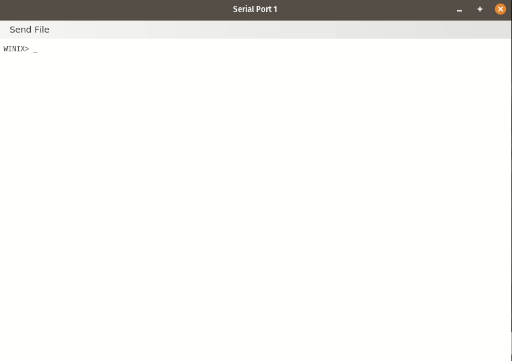
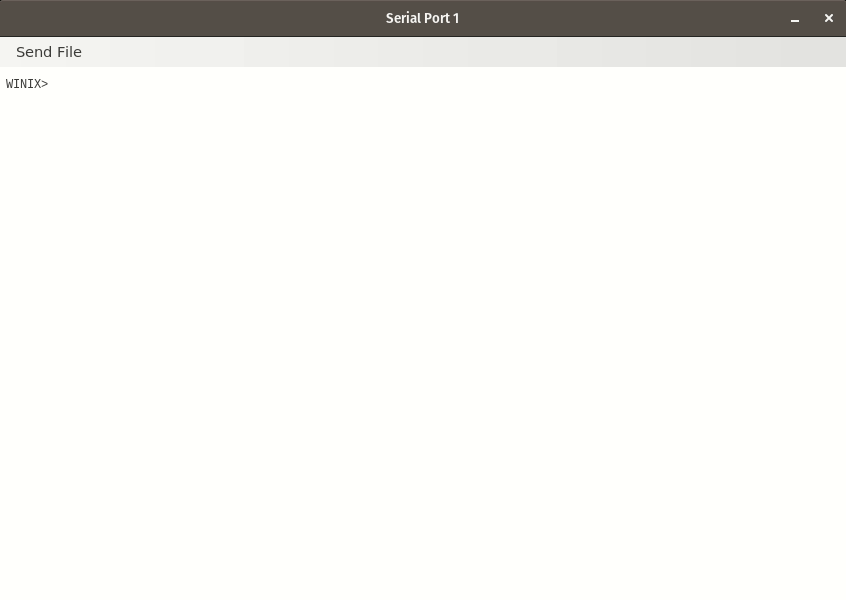
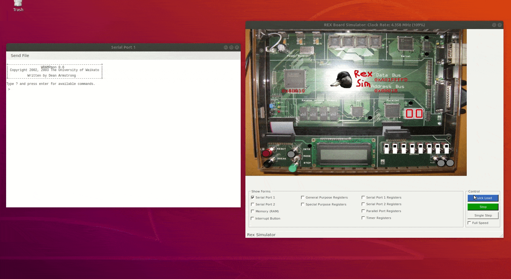

# WINIX OS

 [](https://www.gnu.org/licenses/gpl-3.0)

Winix is a minimal, hobbyist, educational and UNIX-style Operating System for the Waikato RISC Architecture Microprocessor (WRAMP). It is a hybrid kernel with usability and performance in mind. Winix is mainly inspired by Minix1, which is the OS I learnt when I was in university.

Winix includes full-featured kernel with process and memory management, in-memory file system, exception control and user space bourne shell with interactive command line. Yes, you can even play snake on it by typing ```snake``` in the command line

## Demo

### Playing Sake


### Using Pipe in bash


## Features

 - Kernel Memory Management: visual memory, page mapping
 - Process Management: Kernel thread, process creation
 - Exception control and interrupt handler
 - In-memory file system that supports most of the POSIX api
 - A Bourne shell supporting multiple pipes and redirection
 - User memory management: malloc() free()
 - User coroutine with ```ucontext.h``` support
 - Stacktrace dump, segfault analysis

## How to Run

Download the latest Rexsimulator from [Here](https://github.com/halfer53/rexsimulator/releases)

Download the latest WINIX binary ```winix.srec``` from [Here](https://github.com/halfer53/winix/releases)

Run ```Rexsimulator.exe```

Click ```Quick Load```, select ```winix.srec```

### Loading Winix


## How to Compile

### Prerequisite

#### Linux / WSL

```sudo apt-get install xutils-dev gcc```

#### MacOS

``` brew install makedepend gcc```

### Clone and   Compile

```git clone https://github.com/halfer53/winix.git```

```cd winix```

```export PATH=`pwd`/tools/bin:$PATH```

```make```

## Debug tips

### Debug Makefile

Similar to linux kbuild, **Winix** supports verbose option, you can debug Makefile by setting verbose to 1

```make V=1```

### Debug Kernel

```kprintf()``` is your friend. 

```trace```: " type trace in bash to print all the syscalls in serial port 2 


## Supported System Call

```
Name        Syscall Number
TIMES           1
EXIT            2
FORK            3
VFORK           4
EXECVE          5
BRK             6
ALARM           7
SIGACTION       8
SIGRET          9
WAITPID         10
KILL            11
GETPID          12
WINFO           13
STRERROR        14
DPRINTF         15
SYSCONF         16
SIGSUSPEND      17
SIGPENDING      18
SIGPROCMASK     19
SETPGID         20
GETPGID         21
OPEN            22
READ            23
WRITE           24
CLOSE           25
CREAT           26
PIPE            27
MKNOD           28
CHDIR           29
CHOWN           30
CHMOD           31
STAT            32
FSTAT           33
DUP             34
DUP2            35
LINK            36
UNLINK          37
GETDENT         38
ACCESS          39
MKDIR           40
SYNC            41
LSEEK           42
UMASK           43
FCNTL           44
IOCTL           45
SETSID          46
CSLEEP          47
GETPPID         48
SIGNAL          49
SBRK            50
STATFS          51
```

## Credits
[Paul Monigatti](https://nz.linkedin.com/in/paulmonigatti)
